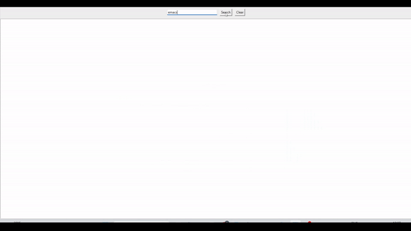

# File Search
=======
# File Explorer
>>>>>>> origin/master

A simple file search application with a GUI interface built using Python and Tkinter. This application allows users to search for files and folders on a Windows system based on a given search query.

## Features

- Search for files and folders containing a specified query
- Display search results in real-time
- Clear the search results
- Responsive GUI

## To-Dos

1. Add a button to stop the search:
   - As of now, the clear button clears only the searches appearing on the window.
   - Implement a feature to stop the search process when the user clicks a "Stop" button.

2. Add filters to search:
   - Add an option to search for standalone words or part of a word.
   - For example, allow searching for "DA" as a standalone word or as part of the word "DANCE".

3. Implement folder navigation:
   - When the user clicks on a search result (pathway), the application should open the folder location in the default file explorer.

4. Add animation while searching:
   - Implement a loading animation or progress bar to provide visual feedback to the user while the search is in progress.

## Dependencies

- Python 3.x
- Tkinter

## Usage

<<<<<<< HEAD
To run the File Search application, execute the following command: ```python file_explorer.py```

=======
To run the File Explorer application, execute the following command: `python file_explorer.py`

## Commit Message

- Update README.md

  - Add information about the generated cache file
  - Update feature list and to-do items
  - Include usage instructions and dependencies
  - Update license information

Please review the changes and make any necessary modifications.

## Cache File

When running the script, a database cache file named `file_explorer_cache.db` will be generated. Please note that this cache file is specific to your local machine and can interfere with the indexing process if transferred to another system. It is recommended not to include this file in the Git repository.
>>>>>>> origin/master

## License

[MIT](https://choosealicense.com/licenses/mit/)

